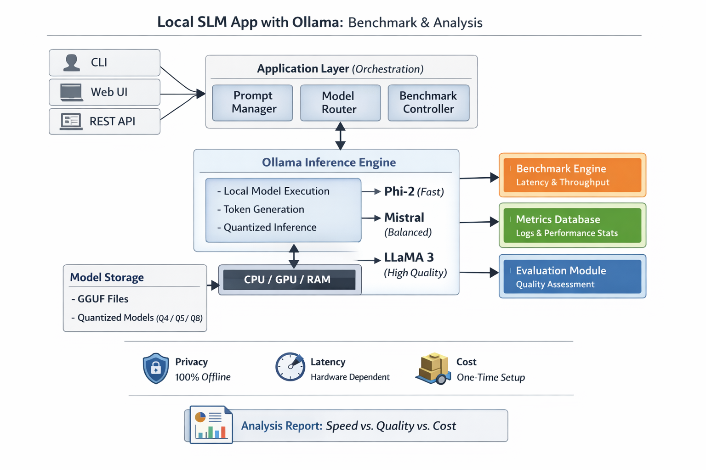

# 🚀 Local SLM Benchmark App (Ollama)

## 📌 Overview
This project benchmarks multiple Small Language Models (SLMs) running locally using Ollama. It compares models on latency, CPU usage, and output quality — highlighting real-world tradeoffs between performance and accuracy.

---

## ⚙️ Features
- Run models completely offline
- Compare multiple models (Phi, Mistral, TinyLlama)
- Measure:
  - Latency
  - CPU usage
  - Memory usage
- Generate benchmark reports
- Modular architecture (FastAPI-based)

---

## 🧠 Models Used
- phi (fast, lightweight)
- mistral (balanced performance)
- tinyllama (low resource)

---

## 🏗️ Architecture
User → FastAPI → Benchmark Engine → Ollama → Local Models

---

## 🚀 Setup

### 1. Install Ollama
https://ollama.com

### 2. Pull Models
```bash
ollama pull phi
ollama pull mistral
ollama pull tinyllama
